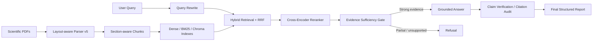
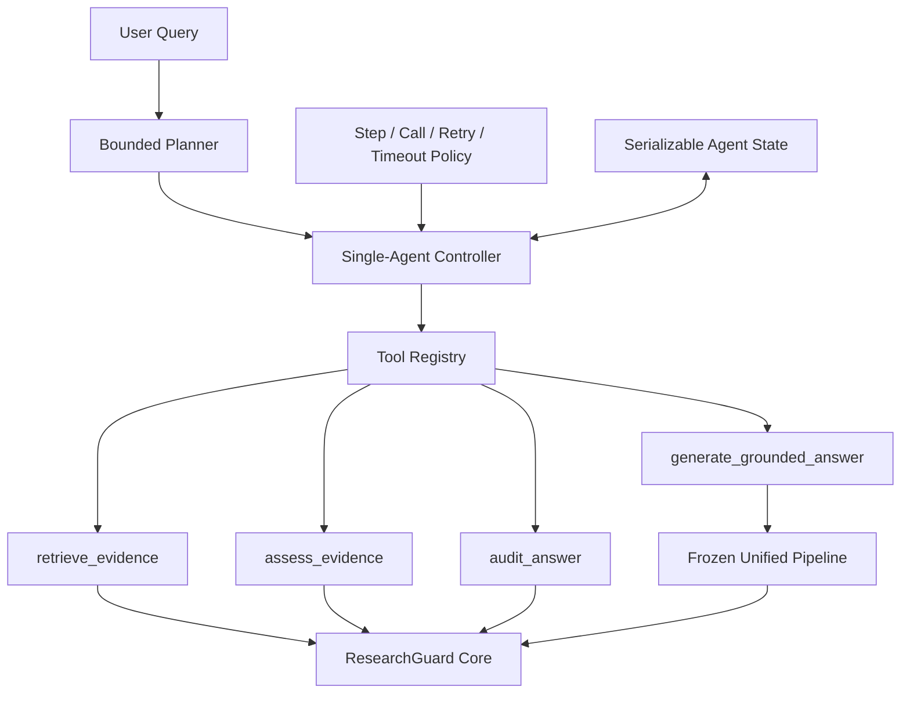

# ResearchGuard

**Evidence-grounded RAG and citation auditing for scientific papers**

## Overview

ResearchGuard 是一个面向科研论文的多文档 RAG 工程。它不止返回与问题相似的段落，而是把版面解析、section-aware chunking、混合检索、Cross-Encoder 精排、查询改写、证据充分性判断、受证据约束的回答生成和逐 claim 引用核验串成一条可审计流程。

当前 Evidence Engine 主流程已经完成本地集成与验证；v2 在其上增加了 Tool Facade 和受约束的单 Agent Controller。历史 Agent、Memory 和早期 Audit 代码仍保留用于兼容，但不属于当前 Controller 的运行路径。

## Architecture



统一入口是 `researchguard.pipeline.ResearchGuardPipeline`。Pipeline 复用各阶段实现，不在 CLI 或 Demo 中复制检索、判断、生成或审计逻辑。

## Agent-ready Architecture

ResearchGuard v2 已完成 **Phase 0 + Phase 1：Evidence Engine Contract + Agent Tool Facade**，并在此基础上完成 **Phase 2：Bounded Single-Agent Controller v1**。这些新增层不改变既有 Parser、Chunking、Indexing、Retrieval 或统一 Pipeline 的核心逻辑。



当前新增的统一契约位于 `researchguard/tools/contracts.py`：

- `ToolResult`：统一记录 `status`、`message/reason`、UTC timestamp、latency、tool name/version、trace ID、data 与结构化 error。
- `EvidenceRecord`：保留 canonical `chunk_id`、`doc_id`、`section`、`page`、content、source、score 与完整 provenance，不引入其他证据 ID 替代现有 chunk ID。
- `ToolError`：统一表达 invalid input、API failure、timeout、retrieval failure 与 execution failure。
- 所有契约带 schema version，并可直接序列化为 JSON。

Tool Facade 位于 `researchguard/tools/`：

| Tool | 包装的既有能力 | 安全边界 |
|---|---|---|
| `retrieve_evidence` | Query Rewrite、Hybrid Retrieval、Chroma、Reranker | 不复制召回或排序逻辑，输出 canonical evidence 与 ranking provenance |
| `assess_evidence` | Evidence Sufficiency | 保持 `strong` / `partial` / `unsupported`，fallback 时 fail closed |
| `generate_grounded_answer` | `ResearchGuardPipeline` | 不暴露裸 `generate_answer`；必须经过 Evidence Gate、Answer Generation 与 Citation Audit |
| `audit_answer` | Citation Audit | 只接受完整 `AnswerGenerationResult` 或其序列化 artifact，拒绝缺少引用 provenance 的裸答案字符串 |

`researchguard/tools/registry.py` 提供可枚举、可注册、可统一调用的 Tool Registry。默认 Registry 仅包含上述四个受控接口，依赖在首次调用时加载。Phase 2 Controller 只能通过该 Registry 调用 Evidence Engine，不直接 import Retrieval、Answer Generator 或 Citation Audit 的内部实现。

对应 synthetic tests 位于 `tests/tools/`，覆盖 schema/JSON 序列化、canonical provenance 往返、重复注册与未知工具错误、裸答案审计拒绝，以及 unsupported/partial evidence 无法触发 Answer Generator。

## Bounded Single-Agent Controller

Phase 2 位于 `researchguard/agent/`：

- `state.py`：定义带 schema version 的 `ResearchAgentState`，记录 query、task type、plan、current step、tool trace、observations、evidence、answer、audit result 和状态时间；支持 JSON 保存与恢复。
- `planner.py`：使用确定性规则生成 structured plan，仅支持 `qa`、`comparison` 和带完整 answer artifact 的 `audit`，不会生成 Registry 之外的工具。
- `policy.py`：默认限制为 `max_steps=6`、`max_tool_calls=10`、`max_retry=2`、`timeout=120s`。
- `controller.py`：执行 `plan → registry tool → observation → state update → stop decision`；Tool failure、Evidence 不足和 policy 超限均会终止。

`qa` 和 `comparison` 的固定有限流程为：

```text
retrieve_evidence
→ assess_evidence
→ generate_grounded_answer
→ audit_answer
```

如果 `assess_evidence` 返回 partial 或 unsupported，Controller 立即设置 `status="rejected"`，不会调用 Answer Tool。`audit` 任务要求调用方提供带 citation provenance 的 answer artifact；如果没有现成 evidence，可以先执行一次 retrieval。

每次 Tool 调用都会记录 `tool_name`、输入摘要、输出状态、latency、timestamp 和 trace ID。当前 Planner 不调用 LLM，不做动态反思或开放式工具探索；项目也没有 Multi-Agent、Memory、LangGraph、autonomous browsing 或无限 ReAct loop。

## Key Features

- **Layout-aware parsing**：使用 PyMuPDF 提取 span、字体与 bbox，恢复单双栏阅读顺序，识别 heading、paragraph、caption、table、equation 和 reference entry。
- **Section-aware chunking**：section 边界强制切分，heading 与正文绑定，保留特殊 block provenance，并限制最终 chunk 长度。
- **Hybrid retrieval**：Dense 与 BM25 独立召回后通过 RRF 融合，可切换 NumPy 或 Chroma dense backend。
- **Query rewrite**：保留实体的标准化改写、最多两条 expansion、多查询 RRF 融合、缓存和失败回退。
- **Evidence gate**：在生成前判定 `strong`、`partial` 或 `unsupported`；非 strong 证据不会进入回答生成。
- **Grounded generation**：生成器只能使用 gate 选定的 evidence，并输出可回溯 citation。
- **Citation audit**：将答案拆为 atomic claims，逐条核验支持程度和 citation provenance。
- **Bounded single agent**：确定性有限计划、Registry-only tool calling、可恢复 state 与 step/call/retry/timeout 约束。
- **Streamlit demo**：展示阶段状态、证据、证据充分性、回答、claim audit 和调试 JSON。

## Project Structure

```text
researchguard/
  ingestion/       PDF layout、block、heading、section 与 chunking
  indexing/        embedding、BM25、NumPy/Chroma index 与 metadata
  retrieval/       retrieval、rewrite、rerank、evidence、answer 与 citation audit
  tools/           Evidence contracts、Tool Facade 与 Registry
  pipeline.py      v1 统一 Pipeline
  cli.py           命令行入口
  agent/           Bounded Planner、Policy、State、Controller 与历史兼容代码
  audit/           历史规则式 audit，当前 claim audit 位于 retrieval/
  memory/          历史 memory 抽象，当前主流程未接入
configs/           各阶段 YAML 配置
scripts/           build、retrieve 与独立 validation 入口
demo/              Streamlit Demo v1
data/eval/         纳入版本控制的评测标注
data/parsed/       本地解析结果，不纳入 Git
data/indexes/      本地索引，不纳入 Git
data/cache/        本地模型/API 缓存，不纳入 Git
outputs/           本地验证报告，不纳入 Git
```

`EvidenceClaw` 与 `rag_agent_harness` 是早期迁移遗留的 Git link，不在当前 Pipeline 依赖闭包内。完整文件分类与依赖审计见 [`PROJECT_CLEANUP_REPORT.md`](PROJECT_CLEANUP_REPORT.md)。

## Installation

Windows PowerShell：

```powershell
git clone https://github.com/Xzh1844963039/ResearchGuard-Agent.git
cd ResearchGuard-Agent
py -m venv .venv
& ".\.venv\Scripts\Activate.ps1"
python -m pip install -r requirements.txt
```

需要调用 OpenAI 的阶段从环境变量读取凭据：

```powershell
$env:OPENAI_API_KEY = "your-key"
```

PDF、解析结果、索引、缓存和验证输出不会随仓库发布。运行完整 Pipeline 前，需要准备本地 corpus，并按 `configs/` 中路径构建 parser/chunk/index/Chroma 资产。当前部分配置保留开发机绝对路径，迁移环境时应先调整为目标工作区路径。

## Quick Start

检查 CLI：

```powershell
python -m researchguard.cli --help
python -m researchguard.cli status
```

运行统一 Pipeline：

```powershell
python -m researchguard.cli run `
  --query "How does CRAG reduce hallucination?" `
  --config configs/pipeline_v1.yaml
```

也可以把完整 JSON 写入本地输出目录：

```powershell
python -m researchguard.cli run `
  --query "What is the difference between RAG-Sequence and RAG-Token?" `
  --output outputs/pipeline_result.json
```

运行受约束的单 Agent Controller：

```powershell
python -m researchguard.cli agent-run `
  --query "Compare CRAG and Self-RAG"
```

可使用 `--task-type qa|comparison|audit` 覆盖确定性任务分类，并用 `--max-steps`、`--max-tool-calls`、`--max-retry` 和 `--timeout` 收紧 policy。`audit` 任务必须通过 `--answer-json` 提供完整 answer artifact；可通过 `--evidence-json` 提供 canonical evidence。`--output` 保存展示报告，`--state-output` 保存可恢复的完整 Agent state。

启动 Demo：

```powershell
streamlit run demo/app.py
```

Demo 展示 Retrieval evidence、Evidence Sufficiency、Grounded Answer、Citation Audit，以及各阶段 latency、model、config version 和 status。异常会转换为页面错误信息，API key、环境变量与内部路径不会展示。

## Data Preparation

单篇 PDF parser 入口：

```powershell
python -m researchguard.ingestion.parse_pdf `
  --input data/raw_docs/parser_eval/paper.pdf `
  --out_dir data/parsed/parser_eval_v5/paper
```

索引与 Chroma 构建入口：

```powershell
python scripts/build_index_v1.py --config configs/indexing_v1.yaml
python scripts/build_chroma_v1.py --config configs/chroma_v1.yaml
```

独立 retrieval 调试：

```powershell
python scripts/retrieve_v1.py `
  --config configs/retrieval_v1.yaml `
  --query "How does CRAG reduce hallucination?" `
  --mode hybrid --rerank --multi-query --evidence-check `
  --generate-answer --citation-audit
```

## Evaluation

以下数字来自仓库开发阶段的固定 benchmark 与五篇论文语料，不是独立 blind hold-out，也不能外推为生产质量。

| Stage | Benchmark result | Interpretation |
|---|---:|---|
| Raw Hybrid Retrieval | Recall@10 `0.9444`, MRR@10 `0.6847`, nDCG@10 `0.6197` | Dense + BM25 RRF baseline |
| Hybrid + Reranker | Recall@10 `0.9722`, MRR@10 `0.7394`, nDCG@10 `0.6626` | Cross-Encoder 提升 Top-10 覆盖与前排排序 |
| Multi-query + Reranker | Recall@10 `0.9722`, MRR@10 `0.7394`, nDCG@10 `0.6468` | 保持 Recall/MRR，nDCG 比 raw rerank 略低 |
| Evidence Sufficiency | accuracy `0.8182`, precision `1.0000`, recall `0.7714` | 44 条评测中 0 false positive、8 false negative |
| No-answer gate | false positive rate `0.0000` | 仅指当前 4 条 unrelated no-answer；retrieval-only FPR 为 `1.0000` |
| Answer Generation | citation coverage `1.0000`, refusal accuracy `1.0000` | 22 条阶段评测；不等同于 citation entailment |
| Citation Audit | unsupported claim recall `1.0000`, citation precision/recall `0.9600/1.0000` | 12 个答案、26 个 atomic claims |

Parser v5 已通过 reading order、heading、block-level section 和 references 验收。Chunking v1 的长度、跨 section、heading-only、重复 block 与 special block coverage 硬性检查通过，并完成 overlap provenance 和 special block 边界修复。统一 Pipeline 的 strong 案例六阶段全部完成；unsupported 与 partial 案例在 Evidence Gate 后拒绝，Answer Generation 和 Citation Audit 跳过。Streamlit startup、strong render contract、unsupported render contract 与显示脱敏检查均通过。

可重复运行的验证入口位于 `scripts/validate_*_v1.py` 和 `scripts/validate_parser_v5.py`。验证会读取本地 data/index/cache，并可能更新被 `.gitignore` 排除的 `outputs/`。

## Design Decisions

- **先恢复文档结构，再做检索**：section、heading 和 block provenance 是后续 evidence 展示与引用审计的基础。
- **召回与排序分离**：Hybrid/RRF 承担候选覆盖，Cross-Encoder 负责 query-chunk 相关性。
- **生成前 fail closed**：证据不是 strong 时拒绝回答；API、JSON、schema 或 provenance 异常不会绕过 gate。
- **生成后逐 claim 审计**：合法 chunk ID 不自动等于引用充分，claim verifier 单独判断支持关系。
- **缓存键包含模型与配置版本**：rewrite、rerank、evidence、answer 和 audit cache 避免跨版本污染。
- **阶段输出保留 provenance**：chunk、document、section、page、query variant 和 stage metadata 可追踪。

## Limitations

- 当前 Planner 是确定性有限 Planner，不进行 LLM task decomposition、动态 re-planning 或开放式工具选择。
- `generate_grounded_answer` 复用完整统一 Pipeline，因此会自行完成检索到审计的全流程；Controller 的显式 `audit_answer` 步骤使用该 Tool 输出中的同源 answer artifact 与 generation evidence，当前会形成一次可缓存的重复审计。
- 独立 `audit_answer` 要求带 citation 与 generation evidence IDs 的完整 answer artifact，不能用来审计无 provenance 的任意文本。
- Controller 的 wall-clock timeout 会在同步 Tool 返回后立即生效，但不能抢占正在执行的同步 Tool；底层 API 调用仍依赖各 Tool 自身 timeout。
- 当前没有长期 Memory、跨任务 session、Multi-Agent、autonomous browsing、无限 reflection 或 autonomous workflow。

- OCR fallback 尚未接入当前 Parser 主流程；扫描件质量依赖原始 PDF 文本层。
- 复杂跨栏表格和视觉结构仍有限；caption/table/equation 主要按同 section、同页、y 距离和文档顺序绑定，不是完整视觉语义理解。
- 当前语料只有五篇开发论文，benchmark 规模较小且不是 blind hold-out。
- Retrieval 会为 no-answer query 返回最近邻；Evidence Gate 只判断传入 Top-k，不能证明整个 corpus 中不存在答案。
- Evidence Judge 当前偏保守，44 条评测仍有 8 个 false negatives。
- LLM 阶段依赖外部 API、模型版本和网络；缓存结果不代表重新调用时的长期稳定性。
- 部分 YAML 配置含本机绝对路径，跨机器使用前需要调整。
- 历史 Agent、Memory、旧 Audit 和两个无 `.gitmodules` 映射的 Git link 尚未重构进主流程。
- 当前是本地 Demo，没有认证、并发隔离、服务化 API、容器化和线上部署。

## Future Work

1. 增加 OCR fallback、复杂表格结构恢复与视觉语义绑定。
2. 在独立 hold-out corpus 上扩充 retrieval、answerability 和 citation audit 评测。
3. 校准 Evidence Sufficiency，降低 false negatives，同时保持 fail-closed 行为。
4. 将本地绝对路径迁移为可移植配置，并补充数据准备 manifest。
5. 在独立 Agent benchmark 上评估 task classification、tool trace、policy stop 和失败恢复，再决定是否引入受约束的短期 session context。
6. 增加稳定 API、并发隔离、可观测性与部署方案。

## Development Documentation Rule

每次新增或修改功能、调整目录、增加脚本、改变运行命令、更新验证结果或推进项目阶段时，必须同步更新 `README.md`。更新至少覆盖当前状态、数据流、核心文件、方法说明、运行命令、输出目录、验证结果、已知限制和下一步计划。若任务明确禁止修改 README，应先说明 README 尚未同步。
