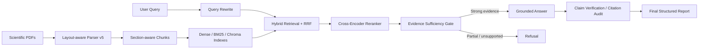
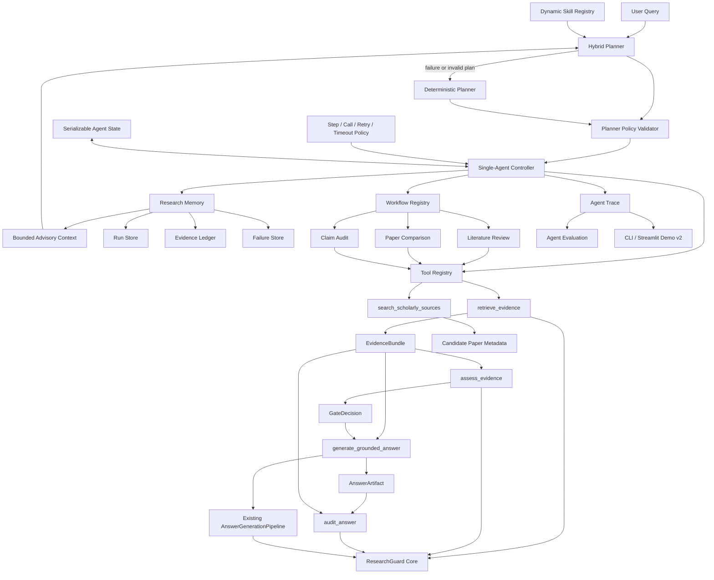

# ResearchGuard

**Evidence-grounded RAG and citation auditing for scientific papers**

## Overview

ResearchGuard 是一个面向科研论文的多文档 RAG 工程。它不止返回与问题相似的段落，而是把版面解析、section-aware chunking、混合检索、Cross-Encoder 精排、查询改写、证据充分性判断、受证据约束的回答生成和逐 claim 引用核验串成一条可审计流程。

当前 Evidence Engine 主流程已经完成本地集成与验证；v2 在其上增加了 Tool Facade、受约束的单 Agent Controller、Scholarly Discovery、Research Workflow Skills、Research Memory 与 Evidence Ledger、Agent Trace、Agent Evaluation、Agent Intelligence Upgrade v1，以及 Hybrid Planner + Dynamic Skill Registry v1。最新 Agent 路径使用单一 Evidence Artifact，允许 LLM 提议严格结构化计划，并由确定性 Policy Validator 与执行预算控制；Planner 不可用或计划非法时自动回退到原确定性 Planner。历史 Agent 和早期 Audit 代码仍保留用于兼容；历史 `MemoryStore` 也继续服务迁移代码，但不承担当前 Controller 的科研过程记忆。

## Architecture



统一入口是 `researchguard.pipeline.ResearchGuardPipeline`。Pipeline 复用各阶段实现，不在 CLI 或 Demo 中复制检索、判断、生成或审计逻辑。

## Agent-ready Architecture

ResearchGuard v2 已完成 Evidence Contract、Tool Facade、Bounded Controller、Scholarly Discovery、Research Workflow Skills、Research Memory、Agent Evaluation，以及 **Agent Intelligence Upgrade v1**。升级没有改变 Parser、Chunking、Indexing、Retrieval 算法或统一 Evidence Pipeline，而是修正了 Agent 层的数据流、有限重规划与评测可信度。



当前新增的统一契约位于 `researchguard/tools/contracts.py`：

- `ToolResult`：统一记录 `status`、`message/reason`、UTC timestamp、latency、tool name/version、trace ID、data 与结构化 error。
- `EvidenceRecord`：保留 canonical `chunk_id`、`doc_id`、`section`、`page`、content、source、score 与完整 provenance，不引入其他证据 ID 替代现有 chunk ID。
- `EvidenceBundle`：封装 query、不可重复的 EvidenceRecord、retrieval metadata、provenance 与基于规范内容计算的稳定 `bundle_id`。
- `GateDecision`：记录 `strong/partial/unsupported`、reason、supporting chunk IDs 和对应 `evidence_bundle_id`，防止 gate 与生成证据错配。
- `ToolError`：统一表达 invalid input、API failure、timeout、retrieval failure 与 execution failure。
- 所有契约带 schema version，并可直接序列化为 JSON。

Tool Facade 位于 `researchguard/tools/`：

| Tool | 包装的既有能力 | 安全边界 |
|---|---|---|
| `retrieve_evidence` | Query Rewrite、Hybrid Retrieval、Chroma、Reranker | 输出 canonical evidence 和稳定 EvidenceBundle，不复制召回或排序逻辑 |
| `assess_evidence` | Evidence Sufficiency | 只评估给定 EvidenceBundle，输出绑定同一 bundle ID 的 GateDecision |
| `generate_grounded_answer` | `AnswerGenerationPipeline` | 只接受 EvidenceBundle + strong GateDecision；不能调用 Retrieval、Evidence Judge 或统一 Pipeline |
| `audit_answer` | Citation Audit | 只审计 AnswerArtifact 与同源 EvidenceBundle；拒绝 bundle 外 citation 或裸答案字符串 |
| `search_scholarly_sources` | arXiv / OpenAlex metadata APIs | 只返回 `metadata_only=true` 的候选论文，不产生 EvidenceRecord |

`researchguard/tools/registry.py` 提供可枚举、可注册、可统一调用的 Tool Registry。默认 Registry 包含上述五个受控接口，依赖在首次调用时加载。Phase 2 Controller 只能通过该 Registry 调用能力，不直接 import Retrieval、Answer Generator 或 Citation Audit 的内部实现。

对应 synthetic tests 位于 `tests/tools/`，覆盖 schema/JSON 序列化、canonical provenance 往返、重复注册与未知工具错误、裸答案审计拒绝，以及 unsupported/partial evidence 无法触发 Answer Generator。

## Hybrid Planner Architecture

Phase 8 Round 1 将初始规划从单一规则分类升级为可回退的 Hybrid Planner，但执行权仍属于 Controller：

```text
Query
→ Hybrid LLM Planner（task understanding / plan proposal）
→ StructuredPlan strict schema
→ PlannerValidator（skill、tool、budget、evidence-first、audit）
→ Controller（execution / observation / bounded replanning）

任一 Planner API、JSON、schema 或 policy 校验失败
→ DeterministicPlanner
→ 同一 PlannerValidator
→ Controller
```

- `researchguard/agent/planner_schema.py` 定义版本化 `StructuredPlan`、`StructuredPlanStep` 与 `PlanBudget`。计划必须包含 `task_type`、`goal`、`steps`、`budget`、`reasoning_summary` 和 `planner_version`；step 必须包含 `skill`、`purpose`、`expected_observation` 和 `max_retry`。未知字段、类型错误和未知 schema 均 fail closed。
- `researchguard/agent/hybrid_planner.py` 定义统一 `PlannerInterface.generate_plan(query)`、OpenAI strict JSON backend、`HybridPlanner` 与兼容原有规则的 `DeterministicPlanner`。配置位于 `configs/planner_v2.yaml`，默认 `temperature=0`、`max_steps=6`，并记录 model、prompt version、latency、token 与 API call count。
- `researchguard/agent/planner_validator.py` 独立验证 task type、skill/tool 是否存在、step/retry/tool-call/revision budget、Evidence Gate 顺序、受保护的 Answer Tool 和 Citation Audit。LLM 只提议计划，不能扩大 Controller policy。
- `researchguard/skills/` 提供动态 `SkillRegistry` 和版本化 `SkillSpec`。当前注册 `retrieve_evidence`、`search_scholarly_sources`、`assess_evidence`、`compare_evidence`、`audit_claims`、`generate_report`；每个 skill 声明 required inputs、output type、allowed tools 和 risk level。Skill 是规划层能力描述，现有 Workflow 与 Tool Registry 保持兼容。
- StructuredPlan 与 Planner metadata 同时进入 `ResearchAgentState` 和 `AgentTrace`。Evaluation 的 API call count 会分别统计 Planner 与 Tool 调用。

当前实现是 **bounded adaptive planner**，不是无限自治 Agent。`AgentPolicy` 仍限制 steps、Tool calls、retry、revision 和 timeout；`max_plan_revisions` 默认且最大为 `2`。LLM 不执行 Tool、不生成最终答案，也不能把 scholarly metadata 变成 canonical evidence。

## Bounded Single-Agent Controller

Phase 2 位于 `researchguard/agent/`：

- `state.py`：定义带 schema version 的 `ResearchAgentState`，记录 query、task type、StructuredPlan、planner metadata、可执行 plan、plan revisions、workflow、EvidenceBundle、GateDecision、tool trace、observations、answer、audit result 和状态时间；支持 JSON 保存与恢复。
- `planner.py`：保留原确定性分类与计划生成，作为 Hybrid Planner 的 fallback 与兼容实现。
- `replanner.py`：根据 retrieval miss、partial evidence 和 retrieval failure 生成版本化 `PlanRevision`，记录 previous plan、observation、new plan 与 reason。
- `policy.py`：默认限制为 `max_steps=6`、`max_tool_calls=10`、`max_retry=2`、`max_plan_revisions=2`、`timeout=120s`。
- `controller.py`：只依赖 Planner Interface，执行 `validated plan → registry tool/workflow → observation → state update → bounded replan/stop decision`；所有修订仍受 step、call、revision 和 timeout budget 约束。

`qa` 的初始有限流程为：

```text
retrieve_evidence
→ assess_evidence
→ generate_grounded_answer
→ audit_answer
```

如果 `assess_evidence` 返回 unsupported，Controller 立即拒绝且不会调用 Answer Tool。partial evidence 最多触发一次扩大 `top_k/candidate_k` 的 retrieval；第二次仍非 strong 时拒绝。`audit` 任务要求调用方提供带 citation provenance 的 answer artifact；如果没有现成 evidence，可以先执行一次 retrieval。

每次 Tool 调用都会记录 `tool_name`、输入摘要、输出状态、latency、API call count、EvidenceBundle ID、timestamp 和 trace ID。Hybrid Planner 可调用 LLM 提议有限计划，但不进行开放式工具执行；项目也没有 Multi-Agent、LangGraph、autonomous browsing 或无限 ReAct loop。Research Memory 只向 Planner 提供受限的历史 run/paper/failure 摘要，不让历史答案改变当前答案。

## Adaptive Agent Loop

Agent Intelligence Upgrade v1 将普通 QA 从固定执行升级为有限状态的 adaptive loop：

```text
Observation
→ BoundedReplanner
→ PlanRevision(previous_plan, observation, new_plan, reason)
→ Next Tool Action
```

- Retrieval 返回 0 evidence、显式低 coverage 或 retrieval failure：第一次修订为 `rewrite/multi-query + expanded retrieval`。
- 扩展 retrieval 仍无 corpus evidence：第二次修订为 scholarly metadata discovery；metadata 不会转成证据，Agent 安全拒绝。
- Evidence Gate 返回 partial：增加 retrieval candidate 范围并重新判断；unsupported 不重规划，直接拒绝。
- Answer、Audit 或未知 Tool 输出失败：不允许绕过 gate 或 citation audit，执行 safe stop。

`PlanRevision` 会进入 `ResearchAgentState.plan_revisions` 和 `AgentTrace.plan_revisions`，Trace timeline 显示 `replan` 事件。该机制是受 `max_plan_revisions=2` 约束的规则式恢复，不是无限 ReAct，也不宣称开放式自主研究。

## Scholarly Discovery Tools

Phase 3 增加了独立的 Scholar Discovery Layer，用于发现可能值得纳入语料库的外部论文：

```text
External Search
→ Candidate Paper Metadata
→ optional user selection / ingestion
→ Parser
→ Index
→ ResearchGuard Retrieval
→ Grounded Answer
```

当前 Provider：

- **arXiv**：默认 Provider，调用公开 Atom API，无需 API key。
- **OpenAlex**：提供 works metadata、venue、citation count 与 open-access metadata；当前官方 API 要求 key，使用环境变量 `OPENALEX_API_KEY`，且只有显式选择该 Provider 时才会调用。

Provider abstraction 位于 `researchguard/tools/scholarly/`，统一实现 `search(query, limit)`。`search_scholarly_sources` 接受 query、可选 source preference 和 `1..50` 的 limit，按 DOI 或 title/year 去重，并返回统一 `ScholarPaperRecord`。每条记录包含 title、authors、year、venue、DOI、URL、abstract、source、paper ID、source type、provider metadata 和 retrieval timestamp。

所有 `ScholarPaperRecord` 强制带有：

```text
metadata_only = true
evidence_eligible = false
```

它们不是 `EvidenceRecord`，没有 canonical chunk ID、page、section 或 parser provenance，不能传给 Answer Tool。Planner 对 `literature_search` 只生成一个 `search_scholarly_sources` step；Controller 将结果保存到 `candidate_papers` 后结束，不会继续生成回答。

搜索缓存位于 `data/cache/scholarly_search_v1/`，cache key 包含 query、provider、config version 和 limit；缓存只保存请求、metadata response 与 timestamp，并被 Git 忽略。

**External Discovery ≠ Evidence Verification。** 外部 metadata 必须经过用户选择、PDF ingestion、Parser、Index 和 ResearchGuard Retrieval 后，才可能成为可引用证据。

## Research Workflow Skills

Phase 4 在 `researchguard/workflows/` 增加科研任务编排层。Workflow 负责固定、可解释的任务顺序；Tool 负责单项能力执行；Evidence Engine 继续负责检索、充分性判断、生成和引用核验。Controller 只根据 Planner 输出的 workflow name 调用 `WorkflowRegistry`，不包含任何具体 workflow 的内部步骤。

统一抽象包括：

- `ResearchWorkflow`：声明 `workflow_name`、description、required tools、input/output schema 和 `run(state)`。
- `WorkflowResult`：记录 version、status、message/reason、结构化 output、完整 trace、起止时间和 latency，可直接序列化为 JSON。
- `WorkflowLimits`：复用 Agent policy 的 step、tool call、retry 和 timeout 上限。
- `WorkflowRegistry`：注册并运行 `literature_review`、`paper_comparison` 和 `claim_audit`。

当前支持三个有限工作流：

| Workflow | 固定流程 | 输出 |
|---|---|---|
| `literature_review` | scholarly search → corpus retrieval → evidence sufficiency → guarded answer → citation audit | candidate papers、canonical evidence、grounded summary、citations、audit、trace |
| `paper_comparison` | identify papers → per-paper retrieval → evidence sufficiency → guarded comparison → citation audit | papers、dimensions、分离的 evidence table、summary、citations、audit、trace |
| `claim_audit` | claim retrieval → evidence sufficiency → citation/claim audit | claim、support level、canonical evidence、citations、audit、trace |

Literature Review 中的 scholarly records 始终保持 `metadata_only=true`，只作为候选列表；summary 只能引用当前本地 corpus 中带 canonical chunk/page/section provenance 的 `EvidenceRecord`。Paper Comparison 可由用户通过 workflow input 指定两篇论文的 name、`doc_id` 和比较维度；提供 `doc_id` 时两次 retrieval 分别使用 document filter，证据表不会混合。Claim Audit 不调用 Answer Generator，而是把用户 claim 与 Evidence Sufficiency 返回的 supporting chunk IDs 组成可审计 artifact，再交给现有 Citation Audit Tool。

`tests/workflows/` 使用 synthetic Tool Registry 验证 metadata/evidence 隔离、unsupported 提前拒绝、双论文 evidence 分离、citation provenance、JSON schema、Registry 选择和 Controller 集成，不修改原 benchmark。

## Research Memory and Evidence Ledger

Phase 5 在 `researchguard/memory/` 增加面向科研任务的持久化层。它记录一次 research run 的任务、workflow、候选论文、canonical evidence IDs、claims、失败原因和 Tool trace；它不是聊天历史、用户画像或偏好学习系统。

默认存储目录为：

```text
data/memory/research_runs/
  runs.jsonl
  evidence_ledger.jsonl
  failures.jsonl
```

该目录被 Git 忽略。第一版使用 append-only JSONL，不引入数据库或 embedding memory。运行开始时写入 `created` RunRecord 快照，结束时写入最终快照；查询时按 `run_id` 读取最新版本，因此保留运行生命周期且不需要覆盖历史文件。中断导致的损坏尾行会被读取层忽略。

核心 schema：

- `RunRecord`：保存 run ID、时间、query、workflow、status、plan、tool trace、papers、evidence IDs、claim IDs、answer summary、audit result、latency、reason 和 schema/version。
- `EvidenceRef`：保存 canonical `chunk_id`、`doc_id`、section、page、source 和 `sha256` content hash；Ledger 不会只保存脱离来源的文本。
- `LedgerRecord`：建立 claim 与一个或多个 EvidenceRef 的关系，并保存 verification status 与来源 workflow。
- `FailureRecord`：记录 no evidence、insufficient evidence、rejected answer、tool failure 或 execution failure。

Workflow 或普通 Agent 任务完成后，Controller 从 Citation Audit claims 及 citations 建立 Ledger；若 workflow 没有逐 claim audit 输出，则使用带 citations 的最终 claim/summary 作为受限 fallback。无法在当前 canonical evidence 中解析的 citation 不会被伪造成 provenance。Rejected/failed run 会额外写入 Failure Store。

Memory 持久化错误不会改变 Evidence Engine 或 Agent 的任务结论。Controller 在 `memory_status` 中记录 started、persisted、ledger count、failure status 和 errors；科研任务结果与存储健康状态保持分离。

Phase 6 增加 `ResearchMemory.search_context(query)`。它只通过 keyword overlap、可选 workflow、以前使用的论文 metadata 和失败记录查找最多 5 个相关 run，不使用 embedding。Controller 在新 run 落盘前读取该上下文，并把经过数量限制的摘要作为 Planner advisory；Planner 的 task classification、workflow selection 和 Tool 列表仍由当前 query 与显式参数确定，历史答案不会进入 Retrieval 或 Answer Generation。

现有 `researchguard.memory.memory_store.MemoryStore` 是早期 EvidenceClaw 单案例兼容层，仍供历史 audit 和迁移验证使用。Phase 5 没有删除或重写它。

## Agent Tracing and Evaluation

Phase 6 在 `researchguard/tracing/` 建立版本化 `AgentTrace`，统一记录 query、StructuredPlan、Planner mode/fallback/latency、可执行 plan、plan revisions、workflow、Tool calls、observations、canonical evidence、answer、citation audit、memory context、memory snapshot 和最终状态。Trace 可直接序列化为 JSON，也可由 formatter 转换为 CLI Markdown；它是只读观测层，不参与 Controller stop decision。

`researchguard/evaluation/` 提供两种评测方式：

- **Labeled evaluation**：`AgentEvaluationCase` 明确给出 expected task type、workflow、Tool sequence、forbidden tools、relevant evidence IDs 和 expected status，用于计算可判定的 planning/workflow accuracy。
- **Runtime evaluation**：只检查当前 run 的 Tool、provenance、效率与 memory 健康度；没有 ground truth 时，task classification 和 workflow accuracy 明确返回 `null`，不会把执行成功冒充准确率。

Agent Evaluation 现在覆盖六类指标：

| Category | Metrics |
|---|---|
| Planning | task classification accuracy、workflow selection accuracy、invalid Tool rate |
| Tool | Tool success rate、Tool call count、unnecessary Tool calls |
| Evidence | provenance validity、evidence coverage、unsupported claim rate |
| Efficiency | latency、step count、retry count、API call count |
| Memory | persistence success、ledger completeness、failure recording |
| Agent Intelligence | replanning rate、successful recovery rate、average plan revision、duplicate Tool call rate、evidence reuse rate |

`scripts/validate_agent_evaluation_v1.py` 保留三个旧 deterministic state-level cases，用于兼容 schema regression。正式 Agent 集成评测入口是 `scripts/validate_agent_benchmark_v2.py`：30 个 case 均从 query 开始执行真实 Planner、Controller、Workflow 和 Tool Registry，禁止直接构造最终 state。该 benchmark 仍使用 deterministic Tool doubles，因此验证的是 Agent 控制逻辑，不代表外部 LLM 或真实科研问题上的回答质量。

## Key Features

- **Layout-aware parsing**：使用 PyMuPDF 提取 span、字体与 bbox，恢复单双栏阅读顺序，识别 heading、paragraph、caption、table、equation 和 reference entry。
- **Section-aware chunking**：section 边界强制切分，heading 与正文绑定，保留特殊 block provenance，并限制最终 chunk 长度。
- **Hybrid retrieval**：Dense 与 BM25 独立召回后通过 RRF 融合，可切换 NumPy 或 Chroma dense backend。
- **Query rewrite**：保留实体的标准化改写、最多两条 expansion、多查询 RRF 融合、缓存和失败回退。
- **Evidence gate**：在生成前判定 `strong`、`partial` 或 `unsupported`；非 strong 证据不会进入回答生成。
- **Grounded generation**：生成器只能使用 gate 选定的 evidence，并输出可回溯 citation。
- **Citation audit**：将答案拆为 atomic claims，逐条核验支持程度和 citation provenance。
- **Bounded single agent**：Hybrid LLM plan proposal、确定性校验与 fallback、Registry-only tool calling、可恢复 state 与 step/call/retry/revision/timeout 约束。
- **Dynamic skill registry**：用版本化 SkillSpec 描述六项细粒度能力，并把规划层 skill 映射到现有受保护 Tool 或 Workflow。
- **Scholarly discovery**：通过可扩展 Provider 发现 arXiv/OpenAlex 候选论文，同时隔离 metadata 与 answer evidence。
- **Research workflow skills**：提供 Literature Review、Paper Comparison 和 Claim Audit 三个可解释、可审计的有限科研工作流。
- **Research memory**：使用版本化 JSONL 保存 research run、证据 lineage 和失败记录，并支持关键词、workflow 与时间过滤。
- **Agent observability**：版本化 trace 串联 plan、workflow、Tool、evidence、answer、audit 与 memory，并提供带标注 benchmark 和无标注 runtime health metrics。
- **Streamlit Demo v2**：可切换 Evidence Pipeline 与 Research Workflow，展示 Agent Plan、Tool Trace、canonical evidence、Evidence Ledger、Memory Context、Evaluation Metrics 和最终结果。

## Project Structure

```text
researchguard/
  ingestion/       PDF layout、block、heading、section 与 chunking
  indexing/        embedding、BM25、NumPy/Chroma index 与 metadata
  retrieval/       retrieval、rewrite、rerank、evidence、answer 与 citation audit
  tools/           Evidence contracts、Tool Facade 与 Registry
    scholarly/     arXiv/OpenAlex Provider abstraction 与 metadata cache
  skills/          Dynamic Skill Registry 与版本化 SkillSpec
  workflows/       Workflow contract、Registry 与三个科研工作流
  memory/          Research Run Store、Evidence Ledger、Failure Store 与历史兼容 MemoryStore
  tracing/         版本化 Agent Trace、collector 与 CLI formatter
  evaluation/      Agent evaluation schema、adaptive metrics、evaluator 与 report renderer
  pipeline.py      v1 统一 Pipeline
  cli.py           命令行入口
  agent/           Hybrid/Deterministic Planner、Validator、Replanner、Policy、State 与 Controller
  audit/           历史规则式 audit，当前 claim audit 位于 retrieval/
configs/           各阶段 YAML 配置
  planner_v2.yaml  Hybrid Planner model、预算、prompt version 与 fallback 配置
scripts/           build、retrieve 与独立 validation 入口
demo/              Streamlit Demo v2
tests/agent/       Controller、Policy、State、bounded replanning 与 planner_v2 tests
tests/evaluation/  Agent benchmark 与 metric regression tests
tests/tracing/     完整 trace 和 JSON/Markdown serialization tests
data/eval/         纳入版本控制的阶段标注与 30-case Agent Benchmark v2
data/parsed/       本地解析结果，不纳入 Git
data/indexes/      本地索引，不纳入 Git
data/cache/        本地模型/API 缓存，不纳入 Git
data/memory/       本地 Research Memory JSONL，不纳入 Git
outputs/           本地验证报告，不纳入 Git
```

早期迁移留下的 `EvidenceClaw` 与 `rag_agent_harness` orphan Git links 已从公开仓库索引移除；本机目录通过 `.gitignore` 保留，不再导致 GitHub checkout 出现不可访问链接。历史分类见 [`PROJECT_CLEANUP_REPORT.md`](PROJECT_CLEANUP_REPORT.md)。

## Installation

Windows PowerShell：

```powershell
git clone https://github.com/Xzh1844963039/ResearchGuard-Agent.git
cd ResearchGuard-Agent
py -m venv .venv
& ".\.venv\Scripts\Activate.ps1"
python -m pip install -e .
```

`pyproject.toml` 记录项目 metadata、Python 版本和直接运行依赖；`requirements.txt` 继续保留当前开发环境的完整 pinned snapshot。如需完全复现本机依赖，可继续执行 `python -m pip install -r requirements.txt`。

需要调用 OpenAI 的阶段从环境变量读取凭据：

```powershell
$env:OPENAI_API_KEY = "your-key"
```

PDF、解析结果、索引、缓存和验证输出不会随仓库发布。运行完整 Pipeline 前，需要准备本地 corpus，并按 `configs/` 中路径构建 parser/chunk/index/Chroma 资产。当前部分配置保留开发机绝对路径，迁移环境时应先调整为目标工作区路径。

## Quick Start

检查 CLI：

```powershell
python -m researchguard.cli --help
python -m researchguard.cli status
```

运行统一 Pipeline：

```powershell
python -m researchguard.cli run `
  --query "How does CRAG reduce hallucination?" `
  --config configs/pipeline_v1.yaml
```

也可以把完整 JSON 写入本地输出目录：

```powershell
python -m researchguard.cli run `
  --query "What is the difference between RAG-Sequence and RAG-Token?" `
  --output outputs/pipeline_result.json
```

运行受约束的单 Agent Controller：

```powershell
python -m researchguard.cli agent-run `
  --query "How does CRAG reduce hallucination?" `
  --planner-config configs/planner_v2.yaml `
  --show-trace `
  --show-memory `
  --show-evaluation
```

发现外部候选论文：

```powershell
python -m researchguard.cli agent-run `
  --query "Find papers about corrective retrieval augmented generation"
```

运行 Research Workflow：

```powershell
python -m researchguard.cli agent-run `
  --query "Review RAG hallucination mitigation" `
  --task-type literature_review

python -m researchguard.cli agent-run `
  --query "Compare CRAG and Self-RAG" `
  --task-type paper_comparison

python -m researchguard.cli agent-run `
  --query "Verify this claim: CRAG uses a retrieval evaluator." `
  --task-type claim_audit
```

可使用 `--task-type qa|comparison|audit|literature_search|literature_review|paper_comparison|claim_audit` 显式指定任务类型，并用 `--max-steps`、`--max-tool-calls`、`--max-retry`、`--max-plan-revisions` 和 `--timeout` 收紧 policy。`--planner-config` 选择 Hybrid Planner 配置；缺少 API key、API 失败、JSON/schema 非法或 policy 校验失败时自动使用 deterministic fallback。`--workflow-input-json` 可以传入 paper name/`doc_id`、comparison dimensions、source preference 或 candidate limit。`audit` 任务必须通过 `--answer-json` 提供完整 answer artifact；可通过 `--evidence-json` 提供 canonical evidence。`--show-trace`、`--show-memory` 和 `--show-evaluation` 分别显示完整执行链、当前 run memory 与 runtime health metrics。`--output` 保存展示报告，`--state-output` 保存可恢复的完整 Agent state。

查看 Research Memory：

```powershell
python -m researchguard.cli memory-list

python -m researchguard.cli memory-show `
  --run-id "agent-..."

python -m researchguard.cli memory-search `
  --query "RAG hallucination" `
  --workflow literature_review
```

`memory-list` 支持 status/workflow/limit 过滤；`memory-search` 使用简单 keyword overlap，并支持 workflow、timestamp 和 limit。它不使用 embedding，也不会把历史答案自动注入新任务。

启动 Demo：

```powershell
streamlit run demo/app.py
```

Demo v2 的 Evidence Pipeline 模式展示 Retrieval evidence、Evidence Sufficiency、Grounded Answer、Citation Audit，以及各阶段 latency、model、config version 和 status。Research Workflow 模式可选择 Literature Review、Paper Comparison 或 Claim Audit，并展示 Agent Plan、workflow、Tool Trace、canonical evidence、Evidence Ledger、Memory Context、Evaluation Metrics 和结构化最终结果。异常会转换为页面错误信息，API key、环境变量与内部路径不会展示。

运行 Agent Evaluation v1 synthetic benchmark：

```powershell
python scripts/validate_agent_evaluation_v1.py
```

报告写入 `outputs/agent_evaluation_v1/agent_evaluation_report.json` 和 `agent_evaluation_report.md`；`outputs/` 不纳入 Git。

运行 Agent Benchmark v2：

```powershell
python scripts/validate_agent_benchmark_v2.py
```

Benchmark v2 从 `data/eval/agent_benchmark_v2/cases.jsonl` 读取 30 条标注，真实执行 Planner、Controller、Workflow Registry 和 Tool Registry。它使用 deterministic Tool doubles，不调用外部 LLM，因此用于验证 routing、replanning、safety boundary 和数据流不变量，而不是衡量真实回答质量。报告写入 `outputs/agent_benchmark_v2/agent_benchmark_v2_report.json` 与 `agent_benchmark_v2_report.md`。

## Data Preparation

单篇 PDF parser 入口：

```powershell
python -m researchguard.ingestion.parse_pdf `
  --input data/raw_docs/parser_eval/paper.pdf `
  --out_dir data/parsed/parser_eval_v5/paper
```

索引与 Chroma 构建入口：

```powershell
python scripts/build_index_v1.py --config configs/indexing_v1.yaml
python scripts/build_chroma_v1.py --config configs/chroma_v1.yaml
```

独立 retrieval 调试：

```powershell
python scripts/retrieve_v1.py `
  --config configs/retrieval_v1.yaml `
  --query "How does CRAG reduce hallucination?" `
  --mode hybrid --rerank --multi-query --evidence-check `
  --generate-answer --citation-audit
```

## Evaluation

以下数字来自仓库开发阶段的固定 benchmark 与五篇论文语料，不是独立 blind hold-out，也不能外推为生产质量。

| Stage | Benchmark result | Interpretation |
|---|---:|---|
| Raw Hybrid Retrieval | Recall@10 `0.9444`, MRR@10 `0.6847`, nDCG@10 `0.6197` | Dense + BM25 RRF baseline |
| Hybrid + Reranker | Recall@10 `0.9722`, MRR@10 `0.7394`, nDCG@10 `0.6626` | Cross-Encoder 提升 Top-10 覆盖与前排排序 |
| Multi-query + Reranker | Recall@10 `0.9722`, MRR@10 `0.7394`, nDCG@10 `0.6468` | 保持 Recall/MRR，nDCG 比 raw rerank 略低 |
| Evidence Sufficiency | accuracy `0.8182`, precision `1.0000`, recall `0.7714` | 44 条评测中 0 false positive、8 false negative |
| No-answer gate | false positive rate `0.0000` | 仅指当前 4 条 unrelated no-answer；retrieval-only FPR 为 `1.0000` |
| Answer Generation | citation coverage `1.0000`, refusal accuracy `1.0000` | 22 条阶段评测；不等同于 citation entailment |
| Citation Audit | unsupported claim recall `1.0000`, citation precision/recall `0.9600/1.0000` | 12 个答案、26 个 atomic claims |

Parser v5 已通过 reading order、heading、block-level section 和 references 验收。Chunking v1 的长度、跨 section、heading-only、重复 block 与 special block coverage 硬性检查通过，并完成 overlap provenance 和 special block 边界修复。统一 Pipeline 的 strong 案例六阶段全部完成；unsupported 与 partial 案例在 Evidence Gate 后拒绝，Answer Generation 和 Citation Audit 跳过。Streamlit startup、strong render contract、unsupported render contract 与显示脱敏检查均通过。

Phase 4 workflow synthetic tests 覆盖三个 workflow 的成功与拒绝路径、metadata/evidence 边界、双论文 document filter、supporting chunk citation、Workflow Registry、Planner/Controller 委托和 Agent state JSON 往返。它们验证编排不变量，不替代真实 corpus 的质量评测。

Phase 5 memory tests 覆盖 RunRecord JSON roundtrip、跨实例持久化、canonical chunk/doc/section/page/hash provenance、failure memory、run isolation、keyword/workflow search、Controller 自动落盘，以及 memory failure 不影响 Agent 任务结论。

Phase 6 synthetic benchmark 的 3 个 case 全部通过：task classification accuracy `1.0000`、workflow selection accuracy `1.0000`、invalid Tool rate `0.0000`、Tool success rate `1.0000`、provenance validity `1.0000`、evidence coverage `1.0000`、unnecessary Tool calls `0`、unsupported claim rate `0.0000`。测试同时覆盖 completed run 的 Evidence Ledger 和 rejected run 的 Failure Store；这些数字只描述 deterministic synthetic cases。

Agent Benchmark v2 的 30 个 integration cases 全部通过：task/workflow accuracy `1.0000`、plan revision accuracy `1.0000`、invalid Tool rate `0.0000`、duplicate Tool call rate `0.0000`、provenance validity `1.0000`、evidence reuse rate `1.0000`。12/30 case 发生重规划，平均 `0.4667` 次 revision；需要恢复的 case 中 `successful_recovery_rate=0.6667`，其余恢复路径按设计安全拒绝。Benchmark 包含 10 个 task routing、10 个 replanning 和 10 个 safety boundary case。

Phase 8 planner_v2 新增 10 个定向测试，覆盖合法 strict JSON 与序列化、非法 JSON、Planner API 异常、未知 skill、超预算、Evidence Gate 绕过、审计后再次生成、Controller Planner Interface、deterministic fallback 与结构化 PlanRevision。当前全量 unittest 为 `96/96 PASS`；这些测试验证规划边界和 fallback 确定性，不代表 LLM 对开放科研任务的规划质量。

`.github/workflows/test.yml` 在 push 和 pull request 上安装 `pyproject.toml` 依赖，并运行 `python -m compileall researchguard` 与 `python -m unittest discover -s tests`。

可重复运行的验证入口位于 `scripts/validate_*_v1.py` 和 `scripts/validate_parser_v5.py`。验证会读取本地 data/index/cache，并可能更新被 `.gitignore` 排除的 `outputs/`。

## Design Decisions

- **先恢复文档结构，再做检索**：section、heading 和 block provenance 是后续 evidence 展示与引用审计的基础。
- **召回与排序分离**：Hybrid/RRF 承担候选覆盖，Cross-Encoder 负责 query-chunk 相关性。
- **生成前 fail closed**：证据不是 strong 时拒绝回答；API、JSON、schema 或 provenance 异常不会绕过 gate。
- **生成后逐 claim 审计**：合法 chunk ID 不自动等于引用充分，claim verifier 单独判断支持关系。
- **缓存键包含模型与配置版本**：rewrite、rerank、evidence、answer 和 audit cache 避免跨版本污染。
- **阶段输出保留 provenance**：chunk、document、section、page、query variant 和 stage metadata 可追踪。

## Limitations

- Hybrid Planner 只负责一次受 schema 约束的 task understanding 与 plan proposal；当前没有多轮 LLM reflection。它的真实规划质量尚未在独立人工标注 hold-out 上评测，API 不可用时会退回确定性规则。
- Dynamic Skill Registry 当前是规划能力目录；科研 Workflow 仍按既有固定内部步骤执行，不支持运行时合成任意新 workflow。
- Replanner 根据 retrieval miss、partial evidence、retrieval failure 等已定义 observation 选择受控恢复路径，最多修订两次，不能为任意科研任务创造新策略。
- `generate_grounded_answer` 已消除内部重复 retrieval/judge/audit，但同步 Answer Generator 仍依赖外部 API timeout，Controller 无法抢占正在执行的同步调用。
- Literature Review 的外部候选 metadata 不会自动下载、解析或进入本地 corpus，因此只列出 discovery candidates；它不会扩大当前可回答证据范围。
- Paper Comparison 只有在 workflow input 提供 canonical `doc_id` 时才能严格隔离每篇论文的 retrieval filter；仅从自然语言识别 title 时，名称查询仍可能召回同一 corpus 中的其他文档。
- EvidenceBundle ID 保证 Agent 各阶段使用同一规范内容，但当前仅在进程内传递，没有签名、外部存储事务或跨服务防篡改机制。
- Workflow state 可以序列化，但当前不支持从 workflow 内部某一步断点续跑；重试恢复会从整个 workflow 起点重新执行，依赖各 Tool cache 控制外部调用成本。
- 独立 `audit_answer` 要求带 citation 与 generation evidence IDs 的完整 answer artifact，不能用来审计无 provenance 的任意文本。
- Controller 的 wall-clock timeout 会在同步 Tool 返回后立即生效，但不能抢占正在执行的同步 Tool；底层 API 调用仍依赖各 Tool 自身 timeout。
- Research Memory 只支持结构化 run、evidence 和 failure 查询；当前跨任务上下文是最多 5 个 keyword/workflow 匹配的受限 Planner advisory，没有聊天历史、用户画像、偏好学习或 embedding retrieval。
- JSONL storage 使用进程内写锁，适合本地单进程 Demo 和开发验证；尚未提供多进程并发事务、压缩、归档或 retention policy。
- Evidence Ledger 的 claim 粒度优先来自 Citation Audit；如果 audit 没有逐 claim 输出，只能把带 citations 的 workflow summary/claim 作为单条 fallback 记录。
- Memory 写入是 fail-open 的旁路记录：持久化失败会出现在 `memory_status.errors`，但不会把已经完成的科研任务改判失败。
- 当前没有跨任务 session、Multi-Agent、autonomous browsing、无限 reflection 或 autonomous workflow。
- Agent Benchmark v2 真实执行 Planner/Controller/Workflow/Tool 边界，但 Tool backend 仍是 deterministic double；尚未建立独立真实论文 hold-out、真实 API failure 和人工质量标注的 Agent benchmark。
- Scholarly Discovery 只返回第三方 metadata，未实现 PDF 自动下载、license 判断、用户选择工作流或自动 corpus ingestion。
- arXiv/OpenAlex 的 metadata 完整性、去重与来源类型取决于第三方记录；abstract 不能替代解析后 chunk evidence。
- OpenAlex 需要单独的 `OPENALEX_API_KEY`，其额度、价格与 API 行为由第三方服务控制。

- OCR fallback 尚未接入当前 Parser 主流程；扫描件质量依赖原始 PDF 文本层。
- 复杂跨栏表格和视觉结构仍有限；caption/table/equation 主要按同 section、同页、y 距离和文档顺序绑定，不是完整视觉语义理解。
- 当前语料只有五篇开发论文，benchmark 规模较小且不是 blind hold-out。
- Retrieval 会为 no-answer query 返回最近邻；Evidence Gate 只判断传入 Top-k，不能证明整个 corpus 中不存在答案。
- Evidence Judge 当前偏保守，44 条评测仍有 8 个 false negatives。
- LLM 阶段依赖外部 API、模型版本和网络；缓存结果不代表重新调用时的长期稳定性。
- 部分 YAML 配置含本机绝对路径，跨机器使用前需要调整。
- 历史 Agent、旧 `MemoryStore` 与旧 Audit 仍作为兼容代码保留；两个 orphan Git links 已从公开仓库索引移除，但对应本机迁移仓库仍保留且被忽略。
- 当前是本地 Demo，没有认证、并发隔离、服务化 API、容器化和线上部署。

## Future Work

1. 增加 OCR fallback、复杂表格结构恢复与视觉语义绑定。
2. 在独立 hold-out corpus 上扩充 retrieval、answerability 和 citation audit 评测。
3. 校准 Evidence Sufficiency，降低 false negatives，同时保持 fail-closed 行为。
4. 将本地绝对路径迁移为可移植配置，并补充数据准备 manifest。
5. 在独立真实 Agent/workflow hold-out 上运行 Hybrid Planner、真实 Retrieval、LLM Judge、Generation 与 Audit，扩展计划有效率、fallback 率、论文识别、恢复质量、成本和失败注入评测。
6. 为候选论文增加显式用户选择与受控 ingestion manifest，并建立 title/DOI 到 canonical `doc_id` 的映射，但仍禁止 metadata 直接进入回答生成。
7. 根据真实 hold-out 的失败分布校准 bounded replanning 触发条件，避免无收益的重复 retrieval，同时维持最大两次 revision。
8. 为 JSONL memory 增加归档、retention、完整性审计和多进程安全方案，再评估是否迁移 SQLite。
9. 评估是否需要比 keyword advisory 更严格的短期 session context；在有 benchmark 前不引入用户画像、Multi-Agent 或开放式自治循环。
10. 增加稳定 API、并发隔离、可观测性与部署方案。

## Development Documentation Rule

每次新增或修改功能、调整目录、增加脚本、改变运行命令、更新验证结果或推进项目阶段时，必须同步更新 `README.md`。更新至少覆盖当前状态、数据流、核心文件、方法说明、运行命令、输出目录、验证结果、已知限制和下一步计划。若任务明确禁止修改 README，应先说明 README 尚未同步。
